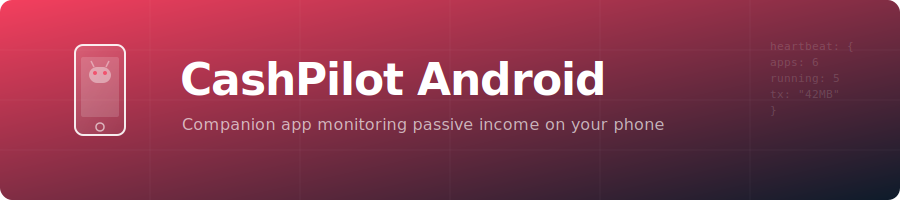

<p align="center">
  
</p>

[](https://codecov.io/gh/GeiserX/CashPilot-android)

# CashPilot Android Agent

Lightweight Android companion for [CashPilot](https://github.com/GeiserX/CashPilot) — monitors passive income apps running on your phone and reports their status to the CashPilot fleet dashboard.

## What it does

CashPilot Android detects which passive income apps are **installed and running** on your device using three complementary Android APIs (no root required):

| API | Signal | Latency |
|-----|--------|---------|
| **NotificationListenerService** | App's foreground service notification is active | Instant |
| **NetworkStatsManager** | App is transferring data (bytes tx/rx per app) | ~2h buckets |
| **UsageStatsManager** | App was recently in foreground | ~2h buckets |

It sends periodic heartbeats to your CashPilot server, so you get a unified fleet view of both Docker containers and Android apps.

## Supported Apps

11 passive income services with Android apps:

EarnApp, IPRoyal Pawns, MystNodes, Traffmonetizer, Bytelixir, ByteBenefit, Grass, Titan Network, Nodle Cash, Uprock, Wipter

## Setup

1. Install the APK on your Android device (Android 8.0+)
2. Grant permissions when prompted:
   - **Notification Access** — detects running apps via their persistent notifications
   - **Usage Access** — reads per-app activity and network stats
   - **Battery Optimization exemption** — prevents Android from killing the heartbeat service
3. Open Settings in the app and enter:
   - Your CashPilot server URL (e.g., `https://cashpilot.example.com`)
   - Your fleet API key (`CASHPILOT_API_KEY` from the server's environment)

## Architecture

```
CashPilot Server (fleet dashboard)
        ^
        | HTTPS POST /api/workers/heartbeat (Bearer auth)
        |
CashPilot Android
├── HeartbeatService (foreground, periodic POST)
├── AppNotificationListener (instant app detection)
├── AppDetector (UsageStats + NetworkStats)
└── Jetpack Compose UI (dashboard + settings)
```

## Building

```bash
./gradlew assembleDebug
# APK at app/build/outputs/apk/debug/app-debug.apk
```

## Tech Stack

- Kotlin + Jetpack Compose
- Ktor HTTP client
- Kotlinx Serialization
- DataStore Preferences
- WorkManager (future: periodic sync when app is backgrounded)
- Material 3 + Dynamic Color

## Privacy

All app status data is sent **only to your own CashPilot server**. The app makes one additional request to `api.ipify.org` to display your public IP on the dashboard — this only happens after both server URL and API key are configured. No other third-party services are contacted.

## Requirements

- Android 8.0+ (API 26)
- CashPilot server v0.2.49+


## Related Projects

| Project | Description |
|---------|-------------|
| [CashPilot](https://github.com/GeiserX/CashPilot) | Self-hosted passive income platform with web UI for setup and earnings tracking |
| [cashpilot-ha](https://github.com/GeiserX/cashpilot-ha) | Home Assistant custom integration for CashPilot passive income monitoring |
| [cashpilot-mcp](https://github.com/GeiserX/cashpilot-mcp) | MCP Server for CashPilot passive income monitoring and fleet management |
| [n8n-nodes-cashpilot](https://github.com/GeiserX/n8n-nodes-cashpilot) | n8n community node for CashPilot passive income monitoring |

## License

GPL-3.0-or-later
